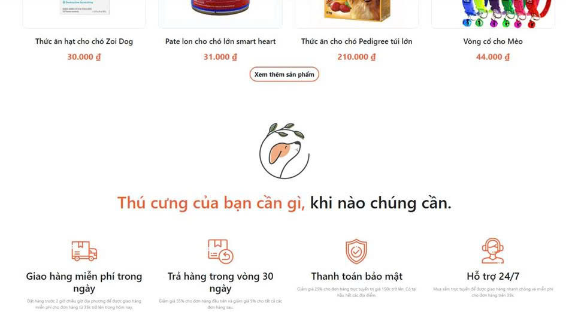
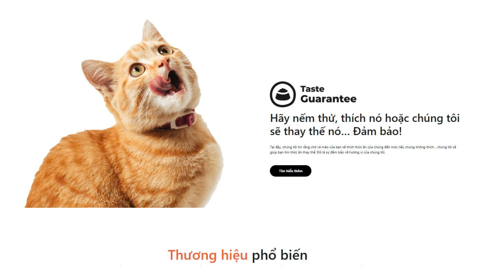
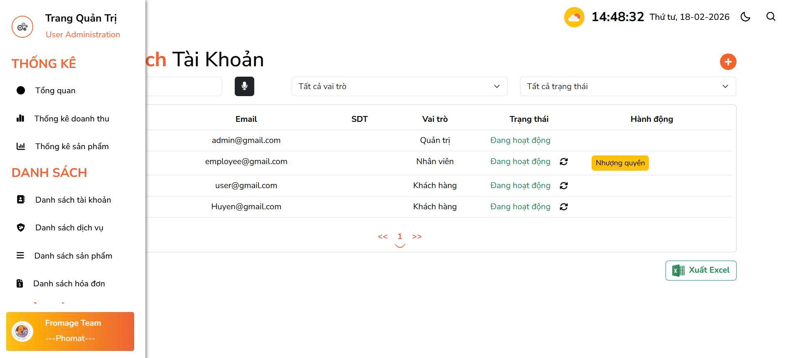
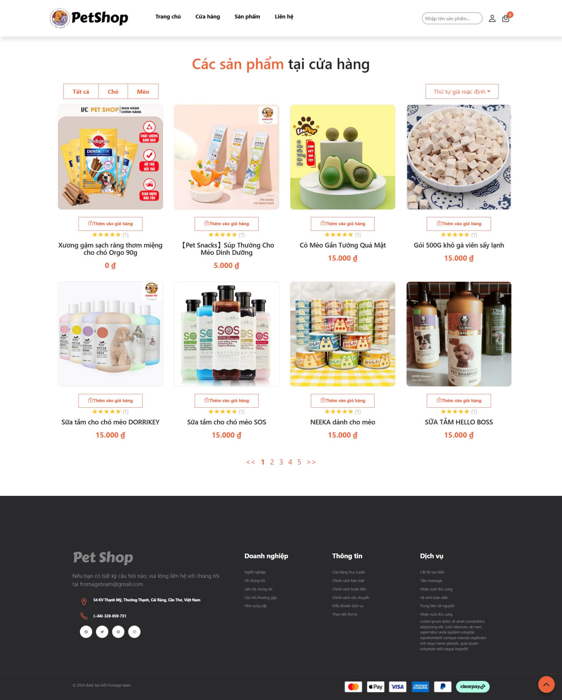
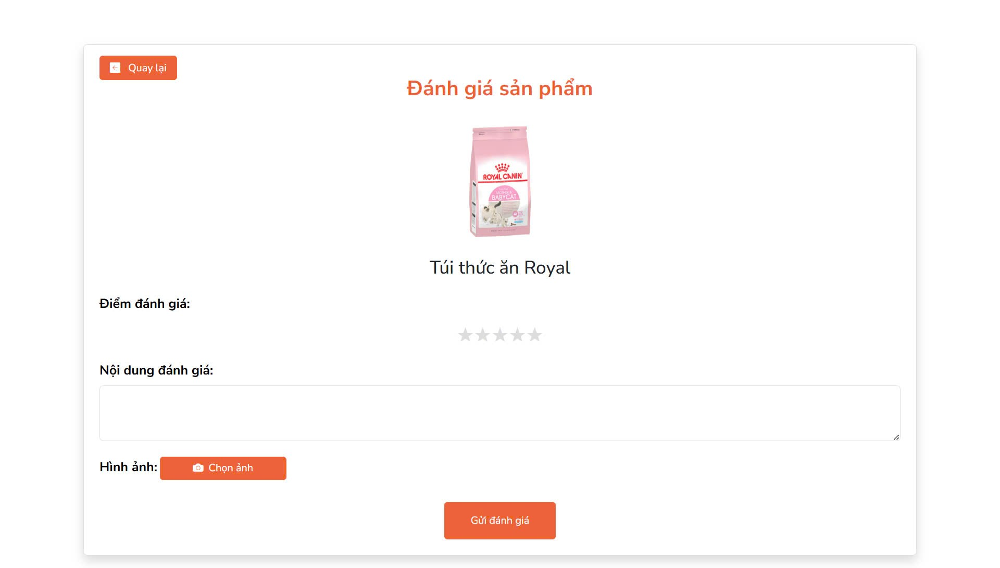
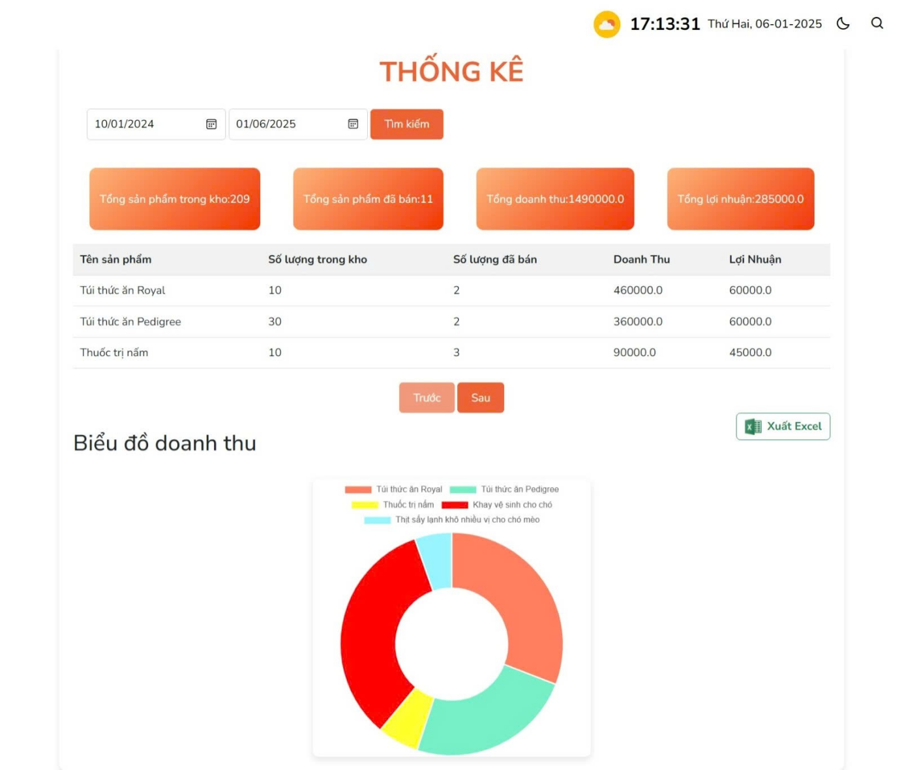
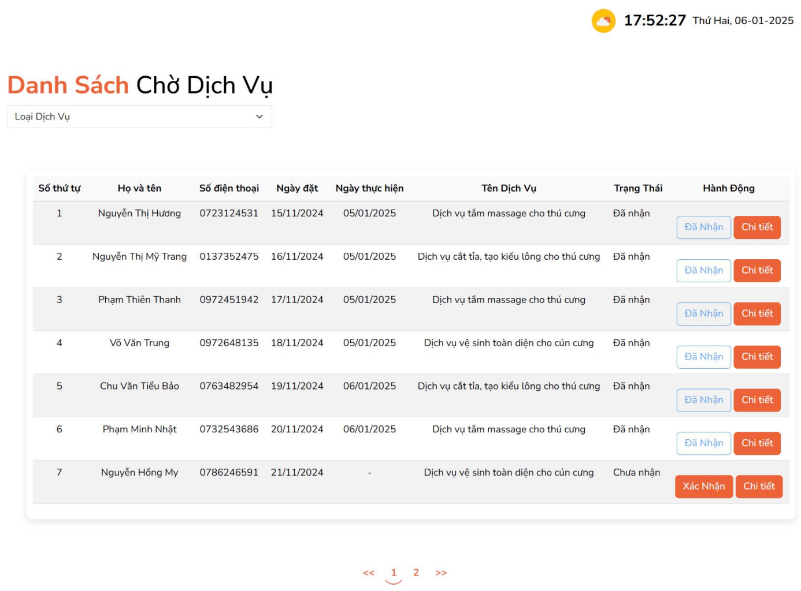
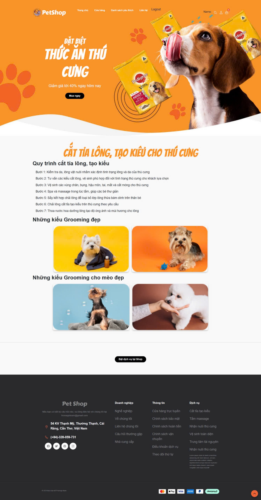
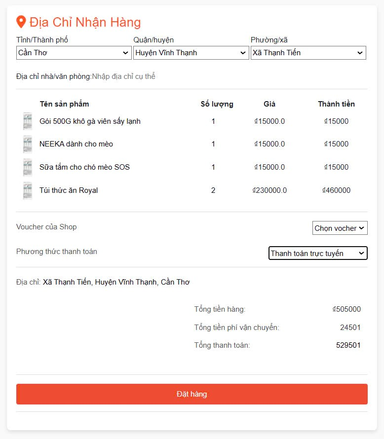
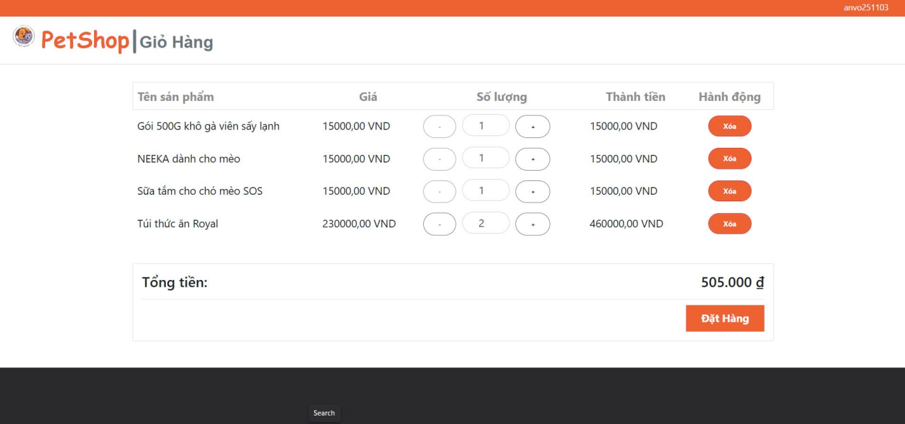

# 🐾 Hệ Thống Quản Lý Cửa Hàng Thú Cưng (PetShop)

## 📌 Giới thiệu
PetShop là hệ thống quản lý cửa hàng thú cưng được xây dựng bằng Spring Boot.  
Hệ thống hỗ trợ 2 vai trò chính: **Admin** và **Khách hàng**.

Chức năng chính
Khách hàng
- Đăng ký / Đăng nhập
- Xem sản phẩm, dịch vụ
- Thêm vào giỏ hàng
- Đặt hàng
Admin
- Quản lý sản phẩm (CRUD)
- Quản lý dịch vụ
- Quản lý đơn hàng
- Quản lý người dùng
  
Công nghệ sử dụng
- Java
- Spring Boot
- Spring Security
- Hibernate (JPA)
- Thymeleaf
- MySQL
- Bootstrap
  
Tài khoản demo 
# Admin:
- Username: anvqpc@gmail.com
- Password: 123
# Employee:
- Username: huyenntmpc07545@fpt.edu.vn
- Password: 1234
# Customer:
- Username: huongnt@gmail.com
- Password: 12345
Hướng dẫn chạy project
1. Clone project: git clone https://github.com/huyennguyen13/huyen2026.git
2. Tạo database: CREATE DATABASE petshop;
3. Import file database
4. Cấu hình application.properties
spring.datasource.url=jdbc:mysql://localhost:3306/petshop
spring.datasource.username=root
spring.datasource.password=yourpassword
5. Chạy project
Run as Spring Boot Application

Cấu trúc bổ sung
[Database SQL](database/petshop.sql): Chứa file SQL  
[`/docs`](docs) : Thiết kế database, tài liệu
- `/images`: Giao diện
# Trang chủ

# Trang quản trị

# Trang sản phẩm

# Đánh giá

# Thống kê

# Chờ dịch vụ

# Đặt dịch vụ

# Đặt hàng

# Giỏ hàng

## 👩‍💻 Tác giả
Huyen Nguyen  
GitHub: https://github.com/huyennguyen13
